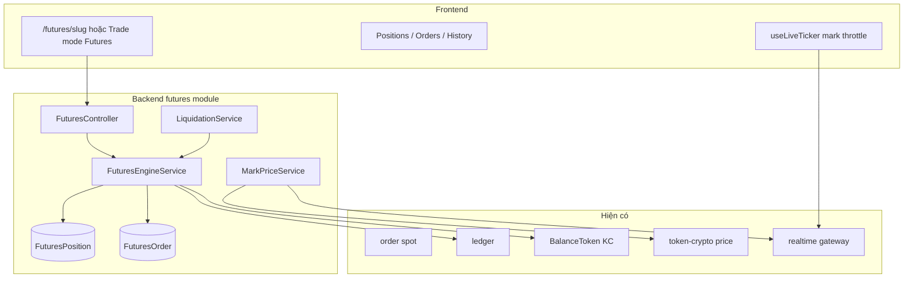

# Đặc tả Futures (Perpetual) — KingCoin

**Phiên bản:** 0.1 (thiết kế)  
**Trạng thái:** MVP implemented (market open/close, liquidation cron, `/futures` UI)  
**Phạm vi:** Hợp đồng vĩnh viễn **BASE/KC**, ký quỹ **KC**, isolated margin, long/short, thanh lý nội bộ.

Tài liệu liên quan: [STABLECOIN_KC_SPEC.md](./STABLECOIN_KC_SPEC.md) · [TECH_SPEC.md](./TECH_SPEC.md) · [UI_DATA_FRESHNESS_SPEC.md](./UI_DATA_FRESHNESS_SPEC.md)

---

## 1. Mục tiêu sản phẩm

| Mục tiêu | Mô tả |
|----------|--------|
| **Giống sàn thật** | Long / Short, đòn bẩy, margin, PnL, liquidation — UX quen thuộc (Binance Futures USDT-M). |
| **Tách Spot** | Engine futures **không** dùng `Order` spot / `matchOrders`. |
| **KC là margin** | Vai trò tương đương USDT-M; không futures trên cặp KC/KC. |
| **Mô phỏng** | Không on-chain; mark price lấy từ spot nội bộ (có thể bị MM/admin). |

---

## 2. Thuật ngữ

| Thuật ngữ | Ý nghĩa |
|-----------|---------|
| **Perpetual (Perp)** | Hợp đồng không ngày đáo hạn. |
| **Cặp** | `SYMBOL/KC` (vd `SLR/KC`). |
| **Long** | Mua tăng — lời khi mark tăng. |
| **Short** | Bán khống — lời khi mark giảm. |
| **Ký quỹ (margin)** | KC khóa khi mở vị thế. |
| **Notional** | `|size| × markPrice` (quy KC). |
| **Mark price** | Giá tham chiếu cho PnL & liquidation. |
| **Isolated** | Mỗi vị thế một ô margin riêng (Pha 1). |
| **Maintenance margin** | Ngưỡng tối thiểu trước liquidation. |
| **Reduce-only** | Lệnh chỉ giảm size, không tăng exposure. |

---

## 3. Phạm vi IN / OUT

### IN (Pha 1 → 2)

- Perpetual `BASE/KC` (alt volatile; **không** KC perp).
- Isolated margin, leverage preset (2x–20x, cấu hình theo token).
- Mở/đóng **market**; limit + reduce-only (Pha 2).
- Vị thế một chiều mỗi cặp (net position): hoặc long **hoặc** short, không hedge hai chiều cùng lúc (đơn giản hóa).
- PnL realized / unrealized (KC).
- Liquidation khi margin ratio < ngưỡng.
- Ledger + WS (`futures` stream).
- Tab **Vị thế** trên trade terminal (đang placeholder).

### OUT (giai đoạn sau hoặc không làm)

- Delivery futures (quý).
- Cross margin (Pha 3).
- Options.
- On-chain margin / bridge.
- Copy trading bots (tab Bot placeholder).
- Funding rate phức tạp (Pha 2 có thể bản đơn giản).

---

## 4. Kiến trúc tổng thể



**Nguyên tắc:** `FuturesEngineService` là single writer cho position + margin KC.

---

## 5. Mark price

### 5.1 Nguồn (ưu tiên)

1. **Mid sổ spot** — `(bestBid + bestAsk) / 2` nếu book đủ depth.  
2. **Fallback** — `TokenCrypto.price` (cùng nguồn spot/WS).  
3. **Stale guard** — nếu mark cũ > `MARK_STALE_MS` (vd 30s) → từ chối mở vị thế mới.

### 5.2 Công thức

```
markPrice = midSpot ?? token.price
```

Làm tròn theo `decimals` token. KC perp **không** tồn tại.

### 5.3 Index (Pha 2, tuỳ chọn)

EMA ngắn trên last trades để giảm manipulation — không bắt buộc Pha 1.

### 5.4 Cảnh báo MM/Admin

Khi admin đẩy giá (market control), UI futures hiển thị banner: *«Giá mark phản ánh thị trường mô phỏng»*.

---

## 6. Vị thế & margin (isolated)

### 6.1 Mở vị thế (market, Pha 1)

Input user:

- `tokenId` (base alt)
- `side`: `long` | `short`
- `leverage`: integer (vd 10)
- `marginKc` **hoặc** `size` (chọn một; UI nên hỗ trợ cả hai)

Tính từ **marginKc** (khuyến nghị UX giống Binance “Cost”):

```
notionalKc = marginKc × leverage
size       = notionalKc / markPrice    // số lượng base token
```

Tính từ **size**:

```
notionalKc = size × markPrice
marginKc   = notionalKc / leverage
```

**Kiểm tra:**

- `marginKc ≥ minMarginKc` (config theo token, vd 10 KC)
- `freeKc ≥ marginKc` (KC khả dụng = balance KC − margin đã khóa các vị thế isolated)
- `size ≥ minSize` (lot size theo token)
- Token không `stablecoin` / không phải KC
- `leverage ≤ maxLeverage[tokenId]` (admin default 20, alt mỏng 5)

**Ghi sổ:**

- Trừ KC khả dụng, tạo `FuturesPosition` `status=open`
- Ledger: `refType=futures_margin_lock`, `amount=-marginKc`

### 6.2 PnL chưa chốt (unrealized)

Long:

```
uPnL = size × (markPrice - entryPrice)
```

Short:

```
uPnL = size × (entryPrice - markPrice)
```

Đơn vị: **KC**. Cập nhật UI theo `useLiveTicker` + throttle ([UI_DATA_FRESHNESS_SPEC.md](./UI_DATA_FRESHNESS_SPEC.md)).

### 6.3 Equity vị thế (isolated)

```
positionEquity = marginKc + uPnL
```

### 6.4 Margin ratio (cho liquidation)

```
marginRatio = positionEquity / notionalKc
notionalKc  = |size| × markPrice
```

Liquidation khi `marginRatio ≤ maintenanceMarginRate` (vd **0.5%** initial margin rate tương ứng leverage 100x là không dùng — với 10x: initial ~10%, maintenance ~0.5%–1% notional, cấu hình rõ trong config).

**Đề xuất maintenance (đơn giản):**

| Leverage | Initial margin % | Maintenance % (of notional) |
|----------|------------------|-----------------------------|
| 2x | 50% | 25% |
| 5x | 20% | 10% |
| 10x | 10% | 5% |
| 20x | 5% | 2.5% |

Hoặc một công thức: `maintenanceMargin = notional × 0.005` (0.5%) tối thiểu `1 KC`.

### 6.5 Đóng vị thế (market)

User đóng toàn bộ hoặc một phần (`closeSize`):

```
realizedPnL = uPnL × (closeSize / size)   // xấp xỉ tại mark hiện tại
returnKc    = marginPortion + realizedPnL
```

- `marginPortion = marginKc × (closeSize / size)` nếu đóng một phần.
- Cập nhật `size`, `marginKc` hoặc `status=closed`.
- Ledger: `futures_close`, `futures_pnl` (có thể gộp một dòng net).

Không cho `returnKc < 0` vượt quá margin đã khóa — nếu lỗ > margin → xử lý như liquidation (bad debt ghi âm KC về 0, log admin).

### 6.6 Thêm margin (Pha 2)

`POST /futures/positions/:id/add-margin` — tăng buffer, giảm risk liquidation.

---

## 7. Thanh lý (liquidation)

### 7.1 Kích hoạt

Định kỳ (mỗi 1–5s per open position) hoặc ngay sau mark update:

```
if marginRatio ≤ maintenanceThreshold:
  triggerLiquidation(position)
```

### 7.2 Xử lý

1. Đóng **toàn bộ** `size` tại `markPrice` (engine nội bộ, không walk book).  
2. Trừ phí liquidation (vd `0.2% notional` → KC, có thể đốt hoặc treasury).  
3. Phần margin còn lại sau lỗ trả user; nếu âm → `0` (insurance fund demo — optional pool KC admin).  
4. `status=liquidated`.  
5. Ledger + thông báo in-app (`FUTURES_LIQUIDATED`) — xem [`NOTIFICATION_SPEC.md`](NOTIFICATION_SPEC.md).  
6. Push notification UI (toast / banner / Web Push).

### 7.3 Auto-deleverage (không Pha 1)

Chỉ cần khi có OI lớn hai phía — bỏ qua demo.

---

## 8. Lệnh (FuturesOrder)

### 8.1 Pha 1

| Loại | Mô tả |
|------|--------|
| `open_market` | Mở long/short |
| `close_market` | Đóng (reduce-only implicit) |

Khớp **tức thì** tại mark (không queue trong book spot).

### 8.2 Pha 2

| Loại | Mô tả |
|------|--------|
| `open_limit` | Chờ mark chạm price |
| `close_limit` | Reduce-only |
| `tp` / `sl` | Trigger khi mark ≥ / ≤ triggerPrice |

Schema order lưu `triggerPrice`, `reduceOnly`, `status: pending|filled|canceled`.

---

## 9. Funding rate (Pha 2 — tuỳ chọn)

Mô phỏng nhẹ: mỗi 8h chuyển KC giữa long/short theo `fundingRate` nhỏ (±0.01%) trên `size × mark`.

- Không bắt buộc MVP.  
- Nếu có: ledger `futures_funding`.

---

## 10. Mô hình dữ liệu (Prisma)

```prisma
enum FuturesSide {
  long
  short
}

enum FuturesPositionStatus {
  open
  closed
  liquidated
}

model FuturesPosition {
  id              String                 @id @default(auto()) @map("_id") @db.ObjectId
  userId          String                 @db.ObjectId
  tokenId         String
  side            FuturesSide
  size            Float                  // base token, luôn dương
  entryPrice      Float                  // KC per base
  leverage        Int
  marginKc        Float                  // isolated locked
  maintenanceKc   Float?                 // snapshot lúc mở (optional)
  realizedPnlKc   Float                  @default(0)
  status          FuturesPositionStatus  @default(open)
  openedAt        DateTime               @default(now())
  closedAt        DateTime?
  liquidatedAt    DateTime?
  updatedAt       DateTime               @updatedAt

  @@index([userId, status])
  @@index([tokenId, status])
}

enum FuturesOrderType {
  open_market
  close_market
  open_limit
  close_limit
  take_profit
  stop_loss
}

enum FuturesOrderStatus {
  pending
  filled
  canceled
  rejected
}

model FuturesOrder {
  id           String             @id @default(auto()) @map("_id") @db.ObjectId
  userId       String             @db.ObjectId
  positionId   String?            @db.ObjectId
  tokenId      String
  side         FuturesSide
  type         FuturesOrderType
  status       FuturesOrderStatus @default(pending)
  size         Float
  price        Float?             // limit/trigger
  leverage     Int?
  marginKc     Float?
  reduceOnly   Boolean            @default(false)
  filledPrice  Float?
  filledAt     DateTime?
  createdAt    DateTime           @default(now())

  @@index([userId, createdAt])
}

model FuturesConfig {
  id              String  @id @default(auto()) @map("_id") @db.ObjectId
  tokenId         String  @unique
  enabled         Boolean @default(true)
  maxLeverage     Int     @default(10)
  minMarginKc     Float   @default(10)
  minSize         Float   @default(0.0001)
  maintenanceRate Float   @default(0.005) // 0.5% of notional
  liquidationFee  Float   @default(0.002) // 0.2% notional
}
```

**KC khả dụng:** không thêm bảng — tính runtime:

```
availableKc = quoteBalance - sum(openPositions.marginKc)
```

Hoặc thêm `Balance.futuresMarginLocked` (denormalized) nếu cần hiệu năng.

---

## 11. API (REST)

Prefix: `/api/v1/futures` — JWT bắt buộc.

| Method | Path | Mô tả |
|--------|------|--------|
| GET | `/config/:tokenId` | maxLeverage, minMargin, enabled |
| GET | `/mark-price?tokenId=` | mark hiện tại |
| GET | `/positions` | Vị thế mở (+ optional closed limit) |
| GET | `/positions/:id` | Chi tiết |
| POST | `/orders` | Mở market (body bên dưới) |
| POST | `/positions/:id/close` | Đóng market (full/partial) |
| POST | `/positions/:id/add-margin` | Pha 2 |
| DELETE | `/orders/:id` | Hủy limit pending |
| GET | `/orders/history` | Lịch sử |

**POST `/futures/orders` (Pha 1 — open market):**

```json
{
  "tokenId": "uuid",
  "side": "long",
  "leverage": 10,
  "marginKc": 100
}
```

Hoặc `{ "size": 50 }` thay `marginKc`.

**Response:** `{ position, order, balances, markPrice }`

**POST `/futures/positions/:id/close`:**

```json
{
  "size": null
}
```

`null` = đóng hết.

---

## 12. WebSocket

Namespace `/realtime` (mở rộng):

| Channel | Payload |
|---------|---------|
| `futures:positions` | user-scoped — position update |
| `futures:mark:{tokenId}` | mark (có thể gộp `ticker`) |
| `futures:liquidation` | user alert |

FE: `useLiveFetch` balances stream `futures`; positions poll hoặc WS.

---

## 13. Ledger `refType`

| refType | Ý nghĩa |
|---------|---------|
| `futures_margin_lock` | Khóa KC mở vị thế |
| `futures_margin_unlock` | Trả margin khi đóng |
| `futures_pnl` | PnL realized |
| `futures_liquidation` | Đóng cưỡng bức + phí |
| `futures_fee` | Phí mở/đóng (nếu tách) |
| `futures_funding` | Funding Pha 2 |

---

## 14. Frontend

### 14.1 Route (đề xuất)

| Route | Mô tả |
|-------|--------|
| `/futures` | Redirect cặp mặc định |
| `/futures/[slug]` | Terminal futures (tách spot) |

Hoặc **toggle Spot | Futures** trên `/trade/[name]` — dùng chung chart, đổi form.

### 14.2 Layout terminal

```
┌─────────────────────────────────────────────┐
│ SLR/KC Perp · Mark · 24h% · Leverage badge  │
├──────────────┬──────────────────────────────┤
│ Chart (reuse)│ Order panel                  │
│              │ [Long] [Short]               │
│              │ Leverage slider 2x-20x       │
│              │ Margin / Size input          │
│              │ Est. liq price               │
├──────────────┼──────────────────────────────┤
│ Order book   │ Tabs: Positions | Orders | History │
│ (spot reuse) │ (bật tab Vị thế thật)      │
└──────────────┴──────────────────────────────┘
```

### 14.3 Ô nhập & hiển thị

- **Cost (KC)** + **Size (SLR)** linked.  
- **Est. liquidation price** (công thức ngược từ maintenance).  
- **Unrealized PnL** + ROE% = `uPnL / marginKc × 100`.  
- Nút **Close** / **Close all** trên mỗi dòng position.

### 14.4 Data freshness

| Khối | Cách |
|------|------|
| Mark, uPnL | `useLiveTicker` + throttle display |
| Positions list | WS `futures` hoặc poll 3s khi tab active |
| Balances KC | `refetch` sau open/close |

---

## 15. Công thức giá thanh lý (hiển thị)

Long (xấp xỉ):

```
liqPrice ≈ entryPrice × (1 - initialMarginRate + maintenanceRate)
```

Short:

```
liqPrice ≈ entryPrice × (1 + initialMarginRate - maintenanceRate)
```

Trong đó `initialMarginRate = 1 / leverage`. UI dùng cùng hằng số backend để tránh lệch.

---

## 16. Admin & vận hành

| Quyền | Hành động |
|-------|-----------|
| Admin | Bật/tắt futures per token (`FuturesConfig`) |
| Admin | `maxLeverage`, `minMargin` |
| Admin | Xem open interest tổng (sum size) |
| MM | Đẩy giá spot → ảnh hưởng mark (đã có market control) |

**Không** cho futures trên KC stablecoin.

---

## 17. Quest & combo sản phẩm

| Quest gợi ý | Điều kiện |
|-------------|-----------|
| `futures-first-open` | Mở 1 vị thế perp |
| `futures-close-profit` | Đóng với PnL > 0 |
| Leaderboard | PnL futures 7 ngày (Pha 3) |

---

## 18. Lộ trình triển khai

### Pha 1 — MVP (4–6 tuần)

- [ ] Prisma models + migration  
- [ ] `MarkPriceService`  
- [ ] `FuturesEngineService` open/close market  
- [ ] `LiquidationService` cron  
- [ ] API + ledger  
- [ ] FE `/futures/[slug]` + Positions tab  
- [ ] 3 token pilot + disclaimer  

### Pha 2 — Giống sàn hơn

- [ ] Limit, TP/SL trigger  
- [ ] Add margin  
- [ ] Funding đơn giản  
- [ ] Lịch sử orders đầy đủ  

### Pha 3 — Ecosystem

- [ ] Cross margin  
- [ ] Leaderboard / quest  
- [ ] Issuer opt-in futures cho token  
- [ ] Insurance fund UI  

---

## 19. Rủi ro & tuân thủ demo

- Ghi rõ trên form: **KingCoin Futures là mô phỏng**, không phải hợp đồng pháp lý.  
- Mark phụ thuộc hệ thống nội bộ — không dùng cho quyết định tài chính thật.  
- Trần leverage và position size tránh abuse quest KC.

---

## 20. Kiểm thử bắt buộc (acceptance)

1. Mở long 10x → mark tăng → uPnL > 0, ROE đúng.  
2. Mở short → mark giảm → uPnL > 0.  
3. Đóng hết → KC trả về ≈ margin + PnL.  
4. Mark di chuyển đủ xa → liquidation → position đóng, ledger khớp.  
5. Không đủ KC → từ chối mở.  
6. Hai user không ảnh hưởng spot escrow khi chỉ trade futures.  
7. WS/poll: positions cập nhật sau close < 3s.

---

## 21. Tham chiếu module (khi implement)

- Backend: [MODULES/BACKEND-futures.md](./MODULES/BACKEND-futures.md)  
- Frontend: [MODULES/FRONTEND-futures.md](./MODULES/FRONTEND-futures.md)
