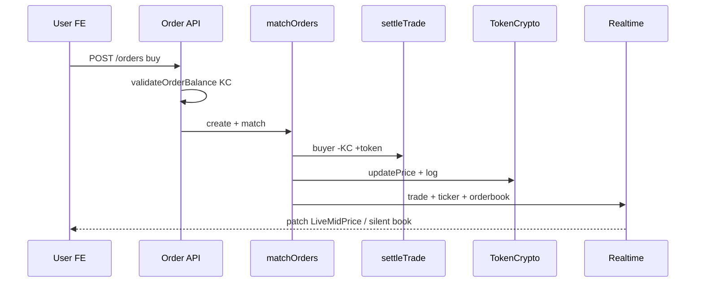

# Kiến trúc & luồng dữ liệu chính

## 1. So sánh với sàn ngoài (spot)

| Lớp | Sàn thật (Binance) | KingCoin |
|-----|-------------------|----------|
| Settlement | On-chain / internal ledger | Mongo `BalanceToken` off-chain |
| Quote | USDT | KC (`KingCoin` token id) |
| Matching | Central engine | `OrderService.matchOrders` |
| Liquidity | Users + MM firms | `MarketMakerService` bot |
| Price discovery | Trades + external index | Trades + MM mid + `initialPrice` |
| Realtime | WebSocket | Socket.IO `/realtime` |

## 2. Luồng end-to-end: đặt lệnh mua



## 3. Luồng: tạo token

1. User trả KC listing fee → `LedgerEntry`
2. `TokenCrypto` created, rank updated
3. Bots nhận inventory base
4. MM refresh → pending orders hai phía
5. User vào `/trade/{name}` trade

## 4. Luồng: kiếm KC → trade

1. Quest claim → KC balance + ledger
2. Hoặc `INITIAL_KC_BALANCE` khi register
3. Convert hoặc limit order trên terminal

## 5. Module phụ thuộc (backend)

```
auth → user
token-crypto → user, ledger, bot-inventory, realtime
order → user, token-crypto (log, price), realtime
quest → user, ledger
convert → user, token-crypto, ledger
market-maker → order, realtime, prisma
ledger → user
```

**Tránh vòng:** `TokenCryptoModule` **không** import `MarketMakerModule` — dùng `BotInventoryModule`.

## 6. Frontend data layer

| Layer | File |
|-------|------|
| REST | `useFetchApi`, `useConfigApi` |
| Live patch | `MarketLiveProvider`, `useLiveTicker` |
| Live refetch | `useLiveFetch` (silent) |
| Mutation | `useMutation` |

## 7. Env quan trọng

| Biến | Ảnh hưởng |
|------|-----------|
| `QUOTE_TOKEN_NAME` | Token KC trong DB |
| `INITIAL_KC_BALANCE` | Register gift |
| `TOKEN_LISTING_FEE_KC` | Tạo token |
| `MARKET_MAKER_*` | Thanh khoản |
| `NEXT_PUBLIC_API_URL` / `API_ORIGIN` | FE REST + WS |

## 8. Ma trận “chuẩn ngoài” — tổng hợp gap

| Tính năng sàn thật | KingCoin |
|--------------------|----------|
| Deposit/withdraw | ❌ |
| KYC | ❌ |
| Futures / margin | ❌ |
| Spot limit + book | ✅ |
| Recent trades | ✅ |
| 24h ticker WS | ✅ (patch) |
| Convert | ✅ |
| Launch token | ✅ |
| Earn/quest | ✅ (subset) |
| Trading fee | ❌ |
| Ledger mọi trade | ⚠️ partial |

Chi tiết từng module: [README.md](./README.md).
