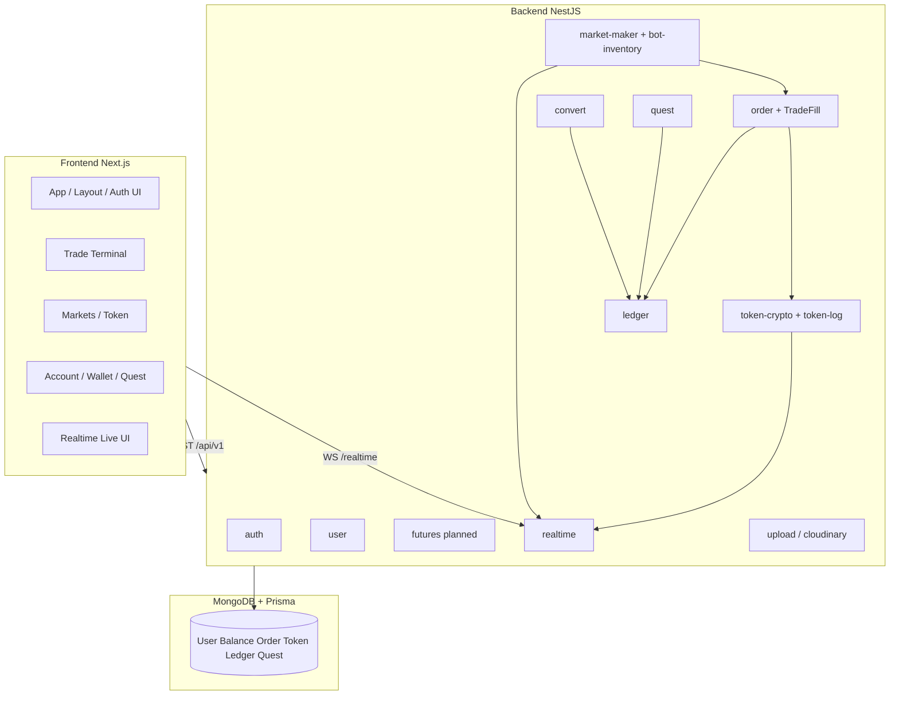

# Đặc tả module — KingCoin (toàn source)

**Phiên bản:** 1.0  
**Ngày:** 2026-05-20  
**Mục đích:** Mô tả logic tính năng **theo từng module** trong monorepo, căn chỉnh với **hành vi sàn spot / ví nội bộ** (Binance, OKX, Coinbase Advanced — mức UX & nghiệp vụ, **không** on-chain/fiat).

## Cách đọc tài liệu

| Cột / ký hiệu | Ý nghĩa |
|---------------|---------|
| **Chuẩn ngoài** | Cách sàn lớn thường làm (tham chiếu) |
| **KingCoin hiện tại** | Đã implement trong repo |
| **Gap** | Chưa có hoặc khác spec ngoài |
| **IN / OUT** | Phạm vi module |

Tài liệu cấp sản phẩm: [PRODUCT_SPEC_KINGCOIN.md](../PRODUCT_SPEC_KINGCOIN.md)  
Kỹ thuật ngắn: [TECH_SPEC.md](../TECH_SPEC.md)  
Lỗ hổng: [GAP_ANALYSIS.md](../GAP_ANALYSIS.md)  
**Audit thực tế:** [MODULE_AUDIT.md](./MODULE_AUDIT.md) · `python3 scripts/audit-modules.py`

## Sơ đồ module

## Danh mục file đặc tả

### Backend (`backend/src/modules/`)

| File | Module | Route API chính |
|------|--------|-----------------|
| [BACKEND-auth.md](./BACKEND-auth.md) | `auth` | `/auth/*` |
| [BACKEND-user.md](./BACKEND-user.md) | `user` | `/users/*` |
| [BACKEND-token-crypto.md](./BACKEND-token-crypto.md) | `token-crypto`, `token-log` | `/token-crypto/*`, `/crypto-logs/*` |
| [BACKEND-order.md](./BACKEND-order.md) | `order`, `TradeFill` | `/orders/*` |
| [BACKEND-ledger.md](./BACKEND-ledger.md) | `ledger` | `/users/me/balances`, `/users/me/ledger` |
| [BACKEND-quest.md](./BACKEND-quest.md) | `quest` | `/quests/*` |
| [BACKEND-convert.md](./BACKEND-convert.md) | `convert` | `/convert/*` |
| [BACKEND-market-maker.md](./BACKEND-market-maker.md) | `market-maker`, `bot-inventory` | (nội bộ, không REST public) |
| [BACKEND-realtime.md](./BACKEND-realtime.md) | `realtime` | Socket.IO `/realtime` |
| [BACKEND-infra.md](./BACKEND-infra.md) | `upload`, `cloudinary`, `casl`, `health` | `/upload`, `/health` |

### Frontend (`frontend/src/`)

| File | Vùng | Route chính |
|------|------|-------------|
| [FRONTEND-shell-auth.md](./FRONTEND-shell-auth.md) | Layout, middleware, auth hooks | `/login`, `/register`, shell |
| [FRONTEND-trade.md](./FRONTEND-trade.md) | Trade terminal | `/trade/[name]` |
| [FRONTEND-market-token.md](./FRONTEND-market-token.md) | Thị trường, token | `/token/list`, `/token/[id]`, `/token/create` |
| [FRONTEND-account-wallet-quest.md](./FRONTEND-account-wallet-quest.md) | Tài khoản, ví, quest, convert | `/account/*`, `/wallet`, `/quest`, `/convert` |
| [FRONTEND-realtime.md](./FRONTEND-realtime.md) | Live price / orderbook | `context/`, `components/live/` |

## Quy ước kinh tế nền tảng (áp dụng mọi module)

| Khái niệm | KingCoin | Chuẩn ngoài (quy đổi) |
|-----------|----------|------------------------|
| Quote / stable nội bộ | **KC** (token `KingCoin`, cấu hình `QUOTE_TOKEN_NAME`) | USDT / USDC |
| Cặp spot | `BASE/KC` (field `pair` trên Order) | `BTC/USDT` |
| Sổ lệnh | Limit orders, price-time priority | Giống CEX spot |
| Khớp lệnh | Off-chain engine trong `OrderService` | Matching engine |
| Ví | `Balance` + `BalanceToken` + `LedgerEntry` | Spot wallet + transaction history |
| On-chain | Không (v1) | Deposit/withdraw chain |
| Fiat | Không (v1) | P2P / card |

## Ma trận module → nguồn code

| Module BE | Path |
|-----------|------|
| auth | `backend/src/modules/auth/` |
| user | `backend/src/modules/user/` |
| token-crypto | `backend/src/modules/token-crypto/` |
| order | `backend/src/modules/order/` |
| ledger | `backend/src/modules/ledger/` |
| quest | `backend/src/modules/quest/` |
| convert | `backend/src/modules/convert/` |
| market-maker | `backend/src/modules/market-maker/` |
| realtime | `backend/src/modules/realtime/` |
| casl | `backend/src/modules/casl/` |
| health | `backend/src/modules/health/` |
| upload | `backend/src/modules/upload/` |

| [MODULE_AUDIT.md](./MODULE_AUDIT.md) | Kết quả audit code + API smoke |

| Vùng FE | Path |
|---------|------|
| Pages | `frontend/src/pages/` |
| Trade UI | `frontend/src/modules/trade/` |
| Live | `frontend/src/context/`, `frontend/src/components/live/` |
| API client | `frontend/src/hooks/useConfigApi.ts`, `useFetchApi.ts` |
